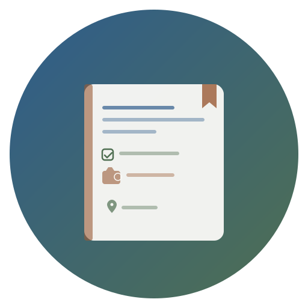
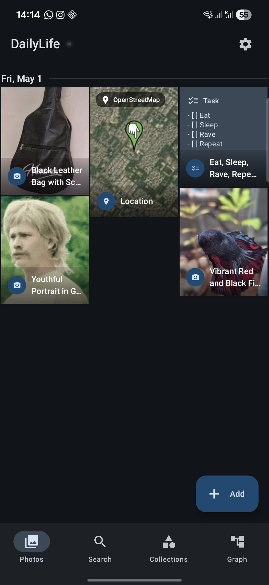
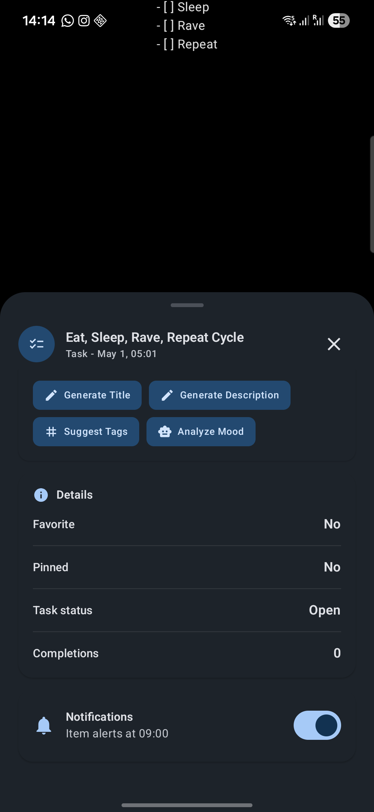
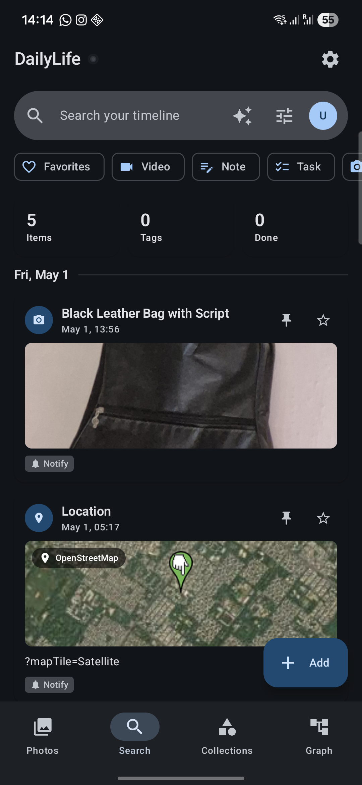
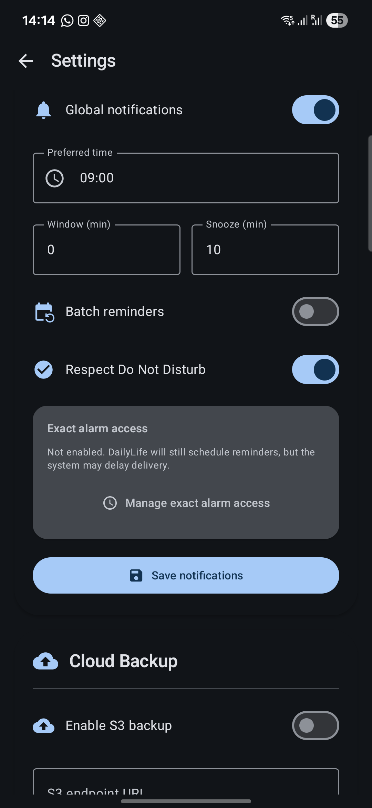
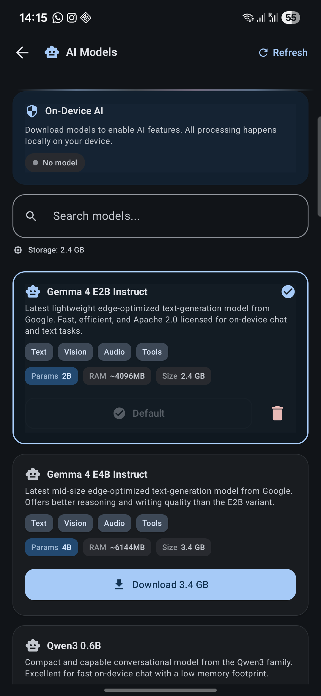
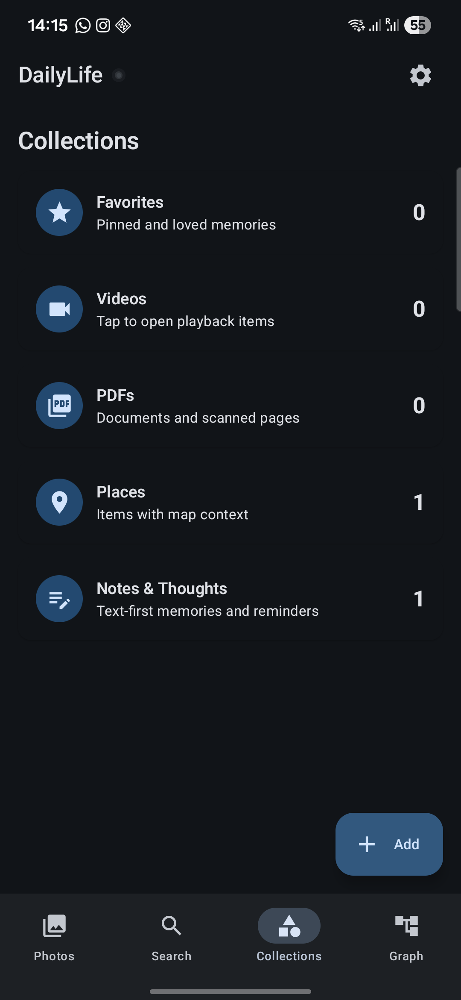

# DailyLife

<p align="center">
  
</p>

<p align="center">
  
  
  
  
</p>

</br>

<p align="middle">
    
    
    
</p>

<p align="middle">
    
    
    
</p>

## Project Overview

DailyLife is a personal life journal and productivity app for Android. It captures thoughts, notes, tasks, reminders, photos, videos, audio recordings, locations, and PDFs in a single unified timeline. With recurring reminders, location-based triggers, speech-to-text, S3-compatible cloud backup, and full local encryption, it serves as a private and extensible daily companion.

## Features

### Journaling & Content Types

- Ten item types: Thought, Note, Task, Reminder, Photo, Video, Audio, Location, PDF, and Mixed
- Quick-add from anywhere with automatic content type inference from pasted text and URIs
- Share intent ingestion — receive text, images, videos, audio, and PDFs from other apps
- Full-text search with type filter, tag filter, date range, favorites, and archived items
- Favorites and archive system for organizing entries

### Tasks

- Status tracking: Open → In Progress → Done
- Recurring task support with configurable schedules
- Completion streaks and history tracking

### Reminders

- Daily, weekly, specific-day, monthly, and monthly Nth-day-of-week recurrence
- Location-based geofence triggers (arrival / departure) via Play Services
- AlarmManager-based exact scheduling with boot-completed receiver

### Media Capture

- In-app camera for photos and video recording
- Audio recording with waveform generation and thumbnails
- Location entries with interactive OpenStreetMap display (osmdroid)
- On-device speech-to-text transcription

### Gallery & Views

- Chronological timeline view as the main screen
- Graph/stats visualization screen
- Full-screen media viewer with horizontal pager navigation and shared element transitions
- Video thumbnail extraction via Coil video decoder
- Share and delete capabilities for any media entry

### Security & Privacy

- Biometric lock (fingerprint / face) via AndroidX Biometric
- SQLCipher encrypted local database
- AES media file encryption backed by Android Keystore
- S3-compatible cloud backup with optional encryption and AWS V4 signing

### UI & Theming

- Material 3 Dynamic Color with automatic palette generation (Android 12+)
- Custom light and dark fallback palettes — calm, nature-inspired steel blue, forest green, and warm copper tones
- Edge-to-edge display support
- Smooth transitions with `SharedTransitionLayout` and micro-animations
- Onboarding flow for first-time users

### Focus & Productivity

- Dedicated focus timer screen with session tracking
- Quick-add sheet for fast entry creation

## Tech Stack

### Android

- Kotlin, Jetpack Compose, Material 3
- MVVM architecture with Kotlin Coroutines and StateFlow
- Hilt for dependency injection
- Room with SQLCipher for encrypted local storage
- CameraX, Media3 ExoPlayer, Coil for media
- OSMDroid for OpenStreetMap integration
- Play Services Location for geofencing
- OkHttp for S3-compatible cloud backup

## Requirements

- Android 10 (API 29) or later
- JDK 17 (for building the Android app)

## Building

### Prerequisites

- Android Studio or Gradle CLI
- JDK 17

### Build Commands

```bash
# Build debug APK
./gradlew assembleDebug

# Build signed release APK (requires keystore environment variables)
# KEYSTORE_PASSWORD, KEY_ALIAS, KEY_PASSWORD must be set
./gradlew assembleRelease
```

## Permissions

| Permission | Purpose |
|---|---|
| `CAMERA` | Photo and video capture |
| `RECORD_AUDIO` | Audio recording and speech-to-text |
| `INTERNET` | S3 cloud backup and map tiles |
| `ACCESS_FINE_LOCATION` / `ACCESS_COARSE_LOCATION` | Location entries and geofencing |
| `ACCESS_BACKGROUND_LOCATION` | Location-based reminder triggers |
| `POST_NOTIFICATIONS` | Reminder and task notifications |
| `RECEIVE_BOOT_COMPLETED` | Re-schedule reminders after device reboot |
| `SCHEDULE_EXACT_ALARM` | Exact alarm delivery for reminders |
| `FOREGROUND_SERVICE` / `FOREGROUND_SERVICE_SPECIAL_USE` | Background media processing |
| `WRITE_EXTERNAL_STORAGE` | Legacy file access (API ≤ 28) |

## Project Structure

```
app/src/main/java/com/raulshma/dailylife/
├── DailyLifeApplication.kt          # @HiltAndroidApp, loads SQLCipher native library
├── MainActivity.kt                  # Entry point, share intent handling, lock/onboarding
├── data/
│   ├── DailyLifeRepository.kt       # Repository interface
│   ├── RoomBackedDailyLifeRepository.kt  # Room-based production implementation
│   ├── InMemoryDailyLifeRepository.kt    # In-memory test implementation
│   ├── backup/                      # S3-compatible backup (AWS V4 signing, OkHttp)
│   ├── db/                          # Room database, DAOs, entities, migrations
│   ├── media/                       # Thumbnails, waveform, PDF preview, URI resolver
│   └── security/                    # AES encryption, Android Keystore, media encrypt/decrypt
├── domain/
│   ├── DailyLifeModels.kt           # Domain models (LifeItem, state, enums)
│   ├── ContentInference.kt          # Auto-detect item type from text/URIs
│   └── S3BackupModels.kt            # Backup settings and result types
├── di/
│   └── DailyLifeModule.kt           # Hilt DI module (DB, repos, services)
├── notifications/
│   ├── ReminderScheduler.kt         # AlarmManager-based scheduling
│   ├── ReminderPlanning.kt          # Reminder recurrence calculation
│   ├── GeofenceManager.kt           # Play Services geofencing
│   └── GeofenceReceiver.kt          # Geofence event broadcast receiver
└── ui/
    ├── DailyLifeApp.kt              # Main app composable (navigation, screens)
    ├── DailyLifeViewModel.kt        # Central ViewModel with StateFlow
    ├── TimelineScreen.kt            # Main chronological timeline view
    ├── GraphViewScreen.kt           # Stats and graph visualization
    ├── FocusTimerScreen.kt          # Focus timer with session tracking
    ├── QuickAddScreen.kt            # Quick-add bottom sheet
    ├── SettingsScreen.kt            # App settings (backup, notifications, lock)
    ├── LockScreen.kt                # Biometric lock screen
    ├── OnboardingScreen.kt          # First-run onboarding flow
    ├── theme/                       # Material 3 theme, color palettes, animations
    ├── components/                  # Shared Compose components (shimmer, card, ripple)
    ├── capture/                     # Camera, audio recorder, location picker, speech
    └── detail/                      # Item detail view and completion history
```

## License

This project is licensed under the GNU General Public License v3.0 — see the [LICENSE](LICENSE) file for details.
